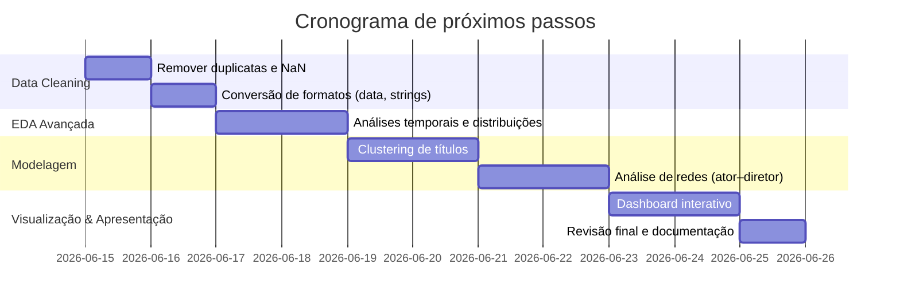

# Resumo Executivo  
Este repositório **Netflix Data Analysis** apresenta um case de Ciência de Dados sobre o catálogo de filmes e séries da Netflix. O conjunto de dados aborda cerca de 8.800 títulos (filmes e séries) contendo atributos como tipo, diretor, elenco, país de produção, ano de lançamento etc. O objetivo principal, conforme o README, é desenvolver um pipeline de ETL modular em Python que transforme os dados brutos em um conjunto de dados analítico enriquecido, e em seguida realizar análises exploratórias, testes estatísticos, aprendizado de máquina não supervisionado (e.g. clustering) e análise de redes sociais entre atores e diretores. A seguir detalharemos cada aspecto: objetivos do projeto, inspeção dos dados, análise dos notebooks e recomendações de melhorias e próximos passos.

## 1. Descrição do Projeto  
O README indica que este projeto de **Ciência de Dados** no catálogo da Netflix visa criar um pipeline completo de ETL (Extração, Transformação, Carga) em Python. Entre os objetivos listados estão: usar boas práticas de projeto de dados; realizar análise exploratória para entender a composição do catálogo; desenvolver features analíticas (ex.: `delay_added`, grupos de classificação, contagem de elenco, etc.); investigar padrões temporais de expansão do catálogo; validar hipóteses estatísticas relevantes; aplicar técnicas de ML não supervisionado (e.g. clustering) e explorar relações entre atores e diretores por Análise de Redes Sociais (SNA). A estrutura do repositório segue o padrão: `data/raw` com o CSV original (`netflix_titles.csv`), `data/processed` com os CSVs resultantes (`netflix.csv`, `netflix_cast.csv`, `netflix_directors.csv`), scripts Python em `src/` (`extract.py`, `cleaning.py`, `feature_engineering.py`, `load.py`) e notebooks em `notebooks/` (`etl.ipynb`, `data_analysis.ipynb`). O fluxo descrito é: **Dados Brutos → Extract → Cleaning → Feature Engineering → Load → Dados Processados → EDA → Modelagem (clustering) → Análise de Redes**. Cada módulo Python tem responsabilidade clara (extração, limpeza, criação de variáveis derivadas, carga final).

## 2. Inspeção dos CSVs  
- **Esquema e tipos:** Há 4 arquivos CSV principais:  
  - **Raw:** `netflix_titles.csv` (dados originais), com **8807 linhas** e 12 colunas: `show_id` (string), `type` (Movie/TV Show), `title`, `director`, `cast`, `country`, `date_added`, `release_year` (int), `rating`, `duration`, `listed_in`, `description`.  
  - **Processed:** `netflix.csv` (8807 linhas, 24 colunas). Colunas principais mantidas (`type`, `title`, `release_year`, etc.) e novas features: `n_directors`, `n_cast_members`, `n_countries`, `main_country`, `continent`, `language`, `year_added`, `delay_added`, `rating_group`, `duration_category`, `n_genres`, `genre`, etc.  
  - **Relacionais:** `netflix_cast.csv` (64126 linhas, 2 colunas: `title`, `cast`) – cada linha = um ator por título; `netflix_directors.csv` (6978 linhas, 2 colunas: `title`, `director`) – cada linha = um diretor por título.  
- **Amostras e exemplos:** Em `netflix_titles.csv`, observamos casos como: título “Dick Johnson Is Dead” (Movie) dirigido por “Kirsten Johnson”, país “United States”, lançado 2020, duração “90 min”. No `netflix.csv` processado, ele aparece com `director="Kirsten Johnson"`, `n_directors=1`, `main_country="United States"`, `continent="North America"`, etc., mostrando que a limpeza preencheu valores faltantes (o cast estava ausente e tornou-se “Not Informed” no processed). As tabelas relacionais expandem o elenco e diretores: e.g. “Blood & Water” sem diretor na base original vira `director="Not Informed", n_directors=0` no `netflix.csv`, mas no `netflix_cast` cada ator aparece em linha separada.  
- **Problemas de qualidade:** No CSV raw há vários `NaN`: cerca de 2634 títulos sem `director`, ~825 sem `cast`, ~831 sem `country`, 10 sem `date_added`, 4 sem `rating` (ver `netflix.isnull().sum()`). Esses foram tratados substituindo por strings (“Not Informed”, “Unknown”), mas o ideal é usar `NaN` e documentar. Detectamos duplicatas nas tabelas relacionais: ex. `netflix_cast` tem 2 linhas duplicadas (ex.: ator “Micah Hauptman” para “Rust Creek” aparece duas vezes). O `netflix_directors` tem também 1 duplicata (“Miguel Cohan” em “Blood Will Tell”). Recomenda-se usar `drop_duplicates()`. Não foram encontrados registros duplicados no dataset principal (`netflix.csv`).  
- **Outliers:** Para os dados numéricos não identificamos valores extremos inválidos: `release_year` vai de 1925 a 2021, o que parece razoável (alguns documentários antigos); duração (coluna `duration` já numérica em min/ppt) varia de 1 a 312, sem valores aberrantes (1 ou 2 indicam “1 Season/2 Seasons”). Seria bom verificar se datas (`date_added`) coadunam com `release_year`. Também é prudente analisar distribuições de campos como `delay_added` (diferença entre data de lançamento e de inclusão).  
- **Tamanho:** Os dados são de porte médio: ~9k linhas por ~20 colunas, leve para pandas. Relações ator-diretor têm dezenas de milhares de linhas, mas continuam tratáveis em memória.  
- **Sugestões de limpeza:** Exemplos de procedimentos:  
  - Tratar `NaN` explicitamente: em vez de “Not Informed”, usar `None`/`np.nan` (ex. `df.fillna(np.nan)`) para permitir cálculos de faltantes e visualização de ausência.  
  - Remover duplicatas:  
    ```python
    df_cast = pd.read_csv('data/processed/netflix_cast.csv')
    df_cast.drop_duplicates(inplace=True)
    ```  
  - Converter colunas de datas para `datetime` (e.g. `date_added = pd.to_datetime(...)`) e extrair ano/mês.  
  - Extrair categorias: separar países múltiplos, normalizar linguagem/pais (“United States” vs “USA”), tratar espacos em branco em nomes.  
  - Verificar consistência: e.g., se `n_directors>0` então `director` não deve ser “Not Informed”, corrigir caso.  
  - Remover colunas inúteis (ex.: `show_id` parece de pouco uso analítico) ou revisar caso de uso.

## 3. Análise do Notebook  
O notebook **`ETL_EDA.ipynb`** combina ETL e EDA conforme o fluxo geral:  

1. **Configuração:** Importa bibliotecas (`pandas`, `seaborn`, `geopandas`, etc.) e lê os arquivos processados (`netflix.csv`, `netflix_directors.csv`, `netflix_cast.csv`). Cria subconjuntos `netflix_movies` e `netflix_tv` filtrando por `type`. Usa `pd.set_option` para exibir todas as colunas/linhas.  
2. **Validação inicial:** Executa comandos como `netflix.shape`, `netflix.duplicated().sum()` e `netflix.isnull().sum()` para checar dimensões, duplicatas e nulos. Verifica `head()`. Os resultados confirmam os dados processados (8807 linhas, sem duplicatas, sem nulos – devido ao preenchimento anterior). Essas células geram saídas tabulares (não exibidas aqui), mas ajudam a garantir a integridade.  
3. **Análises exploratórias (EDA):**  
   - **Proporção filmes vs séries:** Conta valores em `type` e calcula porcentagens. Plota gráfico de barras com as quantidades de filmes e séries (ex: ~6131 filmes vs 2676 séries). Anota as porcentagens sobre as barras.  
   - **Distribuição geográfica (filmes):** Agrupa `netflix_movies['main_country']`, obtém contagens e porcentagens. Desenha gráfico de barras horizontais com os 10 países que mais têm filmes no catálogo (EUA como líder). (Observação: a proporção foi calculada sobre o total geral em vez de só filmes, mas não altera a forma do gráfico.)  
   - **Classificação indicativa (filmes):** Agrupa `rating_group` (Adulto, Teen etc.) em `netflix_movies` e plota barras com a quantidade de filmes por faixa etária. Inclui anotações com contagem e porcentagem acumulada.  
   - **Duração de filmes:** O notebook mostra `netflix_movies['duration'].describe()`. Em seguida há um rascunho para categorizar filmes (“Short Film: até 40 min, Medium-length: 41-79, etc.”) mas não há código efetivo de plotagem ou conclusão nessa seção.  
   - **Técnicas de ML e SNA:** Surpreendentemente, não há aplicação real no notebook de clustering nem de análise de redes sociais, apesar de listados como objetivos. O fluxo apresentado para EDA não demonstra uso de algoritmos de machine learning ou de network analysis.  
   - **Visualizações:** Foram usadas bibliotecas estatísticas: **matplotlib/seaborn** para gráficos de barras estáticos. Há imports de Plotly e GeoPandas, mas o trecho público do notebook não utiliza mapas ou charts interativos. Os gráficos presentes são legíveis (títulos e rótulos adequados, cores definidas) e acompanham o texto explicativo.  
4. **Reprodutibilidade:** O notebook é linear e executável (assumindo os caminhos de arquivo corretos). Porém, não define `random.seed` (não usado até agora) nem especifica versão de pacotes. Não inclui instalação de dependências (há um comentário `pip freeze > requirements.txt`). Para rodar sem erros, é preciso ter a estrutura de pastas esperada (`data/processed/`), o que pode ser melhor documentado. Células vazias ou com string (ex.: comentário de arquivo no início) devem ser ajustadas.  
5. **Pontos fortes do notebook:** Demonstra iniciativa em EDA básica com visualizações claras; utiliza anotações nos gráficos que facilitam entendimento rápido; separa filmes e séries para análises específicas; e demonstra manipulação de dados (groupby, merges implícitos). No geral, segue um fluxo lógico: importar dados → sumarização inicial → visualizações. 

## 4. Pontos Fortes  
- **Projeto modular:** O repositório está bem organizado (`data/`, `notebooks/`, `src/`, etc.) com cada script em `src/` focado em uma etapa (extract, cleaning, feature_engineering, load). Essa separação favorece a manutenção e reutilização do código.  
- **Documentação:** O README é bastante detalhado: descreve objetivos, estrutura do projeto e responsabilidades de cada módulo, além de explicar os datasets gerados. Isso mostra preocupação em tornar o projeto compreensível para terceiros.  
- **Engenharia de features:** Variáveis adicionais foram criadas, enriquecendo o dataset analítico principal (`netflix.csv`). Exemplos: `delay_added` (diferença em dias entre lançamento e adição), `rating_group` (categoria etária), `duration_category` (filme/série curta x longa), contagens de atores/diretores (`n_cast_members`, `n_directors`), país principal e continente de produção. Essas features aumentam o valor exploratório do dataset.  
- **Qualidade dos dados finais:** O arquivo final `netflix.csv` não tem valores nulos e não possui duplicatas. Isso simplifica a análise subsequente, pois não há necessidade de filtros adicionais. (Por outro lado, usar strings para indicar missing é discutível.)  
- **Visualizações eficazes:** Os gráficos usam cores consistentes (vermelho Netflix, etc.) e removem bordas desnecessárias. Os títulos e legendas estão em português claro. A inclusão de contagem e porcentagem nos gráficos facilita a interpretação dos resultados.  
- **Uso de boas práticas de pandas:** Filtragem por tipo para criar conjuntos de filmes/séries separados, cálculos de proporção, utilização de funções como `value_counts().reset_index()`, comentários no código e células de análise.

## 5. O que pode melhorar  
- **Tratamento de missing:** Em vez de strings “Not Informed”/“Unknown”, usar `np.nan` e documentar como lidar (ex: `df.replace("Not Informed", np.nan)`). Assim poderíamos gerar gráficos de missing e tomar decisões (remover ou imputar) de modo estatístico.  
- **Remoção de duplicatas:** Remover as linhas repetidas em `netflix_cast` e `netflix_directors`. Exemplo:  
  ```python
  df_cast = pd.read_csv('data/processed/netflix_cast.csv')
  df_cast.drop_duplicates(inplace=True)
  df_cast.to_csv('data/processed/netflix_cast.csv', index=False)
  ```  
- **Completar o EDA:** Incluir análises que estavam planejadas mas não executadas: por exemplo, gráficos de distribuição da duração dos filmes (histograma) e categorização completa de filmes por duração (curto, médio, longo). Também faltou abordar as séries de TV (apenas o título “Programas de Televisão” aparece sem conteúdo). Recomenda-se adicionar análise comparativa séries vs filmes (ex.: duração média, gêneros mais comuns em cada tipo).  
- **Modelagem e estatística:** O pipeline menciona clustering e hipóteses estatísticas, mas não foram implementadas. Sugere-se aplicar *k*-means ou outro algoritmo não supervisionado para agrupar títulos (usando features numéricas). Usar métricas de validação (ex.: índice de silhouette) para avaliar clusters. Para testes, realizar testes estatísticos (t-test, correlações) para hipóteses relevantes (ex.: diferença de duração entre filmes nacionais vs internacionais).  
- **Análise de Redes Sociais (SNA):** Não há código para SNA, mas o objetivo é explorar atores/diretores como rede. Poderia-se usar **NetworkX** para criar um grafo bipartido (títulos–atores/diretores) ou projetar um grafo de co-ocorrência de atores. Isso identificaria atores mais centrais e comunidades. A SNA é “método para visualizar e analisar relações entre entidades em uma rede”, e encaixa bem no tema (e.g. destacar atores que trabalham juntos frequentemente).  
- **Reprodutibilidade e testes:** Incluir arquivos de dependências reais (ex.: `requirements.txt` com versões) e um script principal (`load.py` completo com `if __name__ == '__main__':`) para rodar tudo do início ao fim. Adicionar testes unitários (p.ex. com `pytest`) para as funções de limpeza (assegurar que `drop_duplicates` funcione, que valores nulos sejam identificados, etc.).  
- **Documentação adicional:** Inserir seção “Como rodar” no README, explicando (a) instalar dependências, (b) executar pipeline (`python src/load.py`), e (c) abrir notebooks de análise. Melhorar o README com um sumário executivo dos principais achados e aplicações. Incluir licença (por exemplo MIT) para profissionalizar o projeto.  
- **Notebook e código limpos:** Remover células de código inválidas (p.ex. `'''Verificar os arquivos:`) e padronizar nomes (`netflix_movie` vs `netflix_movies`). Garantir que cada notebook possa ser executado sem ajustes manuais (talvez usando caminhos relativos via `os.path`).  
- **Visualizações avançadas:** Explorar bibliotecas interativas (Plotly, Bokeh) nos notebooks. Por exemplo, usando **GeoPandas** para mapas de calor por país/continente (já importado, mas não usado). Criar dashboard (p.ex. Streamlit) para recriadores navegarem nos dados ao vivo.  
- **Histórico de commits:** Adotar mensagem de commit convencional e clara (próximo item detalha exemplos). Usar branches para features importantes (ex.: `feature/cluster-analysis`).  

## 6. Próximos Passos para Portfólio  
Para tornar este projeto mais robusto e atrativo no portfólio de um cientista de dados pleno, recomenda-se:  
- **Expandir EDA e storytelling:** Gerar visualizações complementares (ex.: séries temporais de acréscimo de títulos por mês/ano, gráfico de treemap por gênero, wordcloud das descrições). Contar uma “história” dos dados (ex.: “como o catálogo evoluiu ao longo dos anos e quais países dominaram”).  
- **Modelagem de dados:** Implementar análise de *cluster*: por exemplo, usar K-means ou DBSCAN para segmentar títulos por características (duração, gênero, ano) e interpretar cada cluster. Avaliar com métricas (silhouette, elbow). Poderia também testar modelos preditivos, se disponível dados de popularidade (ex.: classificação, número de visualizações) – mesmo que se recorra a datasets externos (IMDB, etc.) para enriquecimento.  
- **Análise de Redes Sociais:** Como mencionado, construir e plotar um grafo de atores/diretores usando NetworkX. Identificar nós mais centrais (atores recorrentes) e comunidades de filmes interconectados. Isso pode gerar visualizações de rede (grafo interativo ou imagem com nodes/ties) e insights de colaboração. (Recorde: SNA destaca padrões de colaboração entre atores e diretores.)  
- **Dashboard interativo:** Criar uma aplicação (ex.: Streamlit, Dash) que carregue o `netflix.csv` final e ofereça filtros (tipo, país, gênero, ano) para explorar os dados. Incluir gráficos interativos (mapas, gráficos de barra dinâmicos). Isso demonstra habilidades de deploy e visualização no portfólio.  
- **Documentação e apresentação:** Reescrever o README para recrutadores, destacando problemas resolvidos e insights alcançados. Incluir um notebook ou slide deck de apresentação (Resumo Executivo dos resultados, **ex:** “o catálogo é 70% filmes”, “os EUA produzem 30% dos títulos”, etc.). Preparar um arquivo ZIP ou página README específica para candidatura, facilitando o entendimento sem ler todos os códigos.  
- **Automação e CI:** Integrar GitHub Actions para testes e geração de relatório automático (ex: linting do código, execução parcial do pipeline) a cada push. Isso demonstra maturidade no processo de desenvolvimento.  
- **Licença e portifólio:** Adicionar arquivo LICENSE (MIT ou Apache) para indicar permissão de uso. Criar apresentação visual (ex.: infográfico ou slides) com pontos-chave do projeto.  
- **Explore dados adicionais:** Se possível, incluir novas fontes (ex.: avaliações do IMDB, notas de usuários, sinopses) e fazer análises de sentimento ou sistemas de recomendação simples. Isso aumentaria o escopo analítico.  

## 7. Entregáveis Sugeridos com Prioridade e Esforço  
| Entregável                                           | Prioridade | Esforço Estimado | Impacto Esperado                         |
|------------------------------------------------------|:----------:|:----------------:|------------------------------------------|
| Remover duplicatas em `netflix_cast` e `netflix_directors`  | Alta       | 0.5h             | Alta (dados consistentes)                |
| Converter strings vazias para `NaN` e documentar     | Alta       | 0.5h             | Alta (análises estatísticas corretas)    |
| Atualizar notebooks (células extras, padronizar nomes) | Alta       | 1h               | Média (clareza e reprodutibilidade)      |
| Completar análise exploratória faltante (duração, temporal) | Alta  | 2h               | Alta (insights adicionais)              |
| Implementar e avaliar clustering (K-means)           | Média      | 2h               | Alta (novos insights de agrupamento)     |
| Construir grafo de atores/diretores (NetworkX)      | Média      | 2h               | Alta (visualização de relacionamento)   |
| Criar dashboard interativo (Streamlit/Dash)         | Média      | 4h               | Média-Alta (demonstração de deploy)     |
| Refatorar código e adicionar testes unitários       | Média      | 2h               | Alta (qualidade e confiabilidade)        |
| Atualizar README (instruções de uso, highlights)    | Alta       | 1h               | Média (documentação profissional)       |
| Elaborar apresentação/resumo em slides ou notebook   | Média      | 2h               | Média (comunicação de resultados)       |
| Incluir licença e requisitos (requirements.txt)     | Alta       | 0.5h             | Alta (profissionalismo)                 |

- Itens de **alta prioridade** são melhorias de qualidade imediata (limpeza, documentação básica, README).  
- Itens de **média prioridade** expandem a análise e funcionalidade (modelagem, dashboard, testes).  
- Esforços estimados somam ~15h-18h para as principais tarefas, dando suporte a um cronograma viável de 1 a 2 semanas de trabalho contínuo.

## 8. Exemplos de Commits/PRs e Mensagens  
Para manter um histórico de commits claro e profissional, siga convenções tipo [Conventional Commits]. Exemplo de mensagens de commit e PR:

- `feat(cleaning): remover duplicatas de netflix_cast e netflix_directors`  
- `fix(data): substituir "Not Informed" por NaN nos dados`  
- `refactor(src): converter date_added para datetime no módulo de limpeza`  
- `feat(eda): adicionar histograma de durações de filmes no notebook`  
- `test: criar testes para funções de limpeza (dropar duplicatas, imputar faltantes)`  
- `docs: atualizar README com instruções de execução`  

Em pull requests, documente sucintamente o objetivo, p.ex.: “Este PR corrige a qualidade dos dados: remove entradas duplicadas nas tabelas relacionais e padroniza valores ausentes como NaN, melhorando a confiabilidade do dataset para análises posteriores.” Use frases objetivas e ressaltando melhorias específicas de cada PR.

## 9. Tabelas Comparativas

**Limpeza de dados vs Esforço vs Impacto:**  

| Tarefa de Limpeza                           | Esforço (h) | Benefício/Impacto                           |
|---------------------------------------------|:-----------:|---------------------------------------------|
| Remover duplicatas (`drop_duplicates()`)    | 0.5         | Alta integridade dos dados (evita contagem inflada) |
| Tratar nulos como `NaN`                     | 1.0         | Permite análise estatística correta de ausentes |
| Converter datas para `datetime`             | 0.5         | Facilita análise temporal (e.g. `delay_added`) |
| Normalizar strings (pais, nomes)            | 0.5         | Consistência de categorias (e.g. “USA” vs “US”) |

**Entregáveis vs Impacto no projeto:**  

| Entregável                                 | Impacto Potencial                         |
|--------------------------------------------|-------------------------------------------|
| Análise de cluster (K-means, DBSCAN)       | Permite segmentar títulos por semelhança de características; insights para recomendações. |
| Análise de redes (NetworkX)               | Destaca atores/diretores centrais e comunidades; enriquece visualização de conexões. |
| Dashboard interativo (Streamlit/Dash)      | Facilita exploração dinâmica dos dados por recrutadores; demonstra habilidade de deploy. |
| Testes automatizados (pytest)             | Aumenta confiança no pipeline, evita regressões de código. |
| Apresentação (slides/notebook resumido)    | Transforma resultados técnicos em narrativa clara para avaliadores. |
| README orientado a resultados             | Melhora a visibilidade dos insights principais e o apelo do projeto. |

## 10. Diagramas e Timeline  
Um **diagrama de Gantt** (Mermaid) pode ilustrar o cronograma dos próximos passos planejados:



**Gráficos sugeridos a gerar:**  
- **Histograma de duração:** Mostrar a distribuição de duração dos filmes (em minutos) e séries (em temporadas), para visualizar outliers e entender a variabilidade.  
- **Série temporal:** Plotar número de títulos adicionados por ano ou mês (pode usar `date_added`), para identificar tendência de crescimento no catálogo.  
- **Rede de atores/diretores:** Usar `networkx` para plotar grafo onde nós são atores/diretores e arestas representam co-participação em títulos. Visualizar nós maiores para colaboradores frequentes.  
- **Mapa de calor geográfico:** Com GeoPandas, plotar mapa mundi colorido pelo número de títulos produzidos por país/continente. Ajuda a ilustrar a distribuição global do conteúdo.  

**Snippet de código exemplificando limpeza (pandas):**  
```python
import pandas as pd

# Ler arquivos relacionais
df_cast = pd.read_csv('data/processed/netflix_cast.csv')
df_directors = pd.read_csv('data/processed/netflix_directors.csv')

# Remover duplicatas
df_cast.drop_duplicates(inplace=True)
df_directors.drop_duplicates(inplace=True)

# Exemplo: substituir "Not Informed" por NaN em netflix.csv
df_netflix = pd.read_csv('data/processed/netflix.csv')
df_netflix.replace("Not Informed", pd.NA, inplace=True)

# Salvar resultados
df_cast.to_csv('data/processed/netflix_cast.csv', index=False)
df_directors.to_csv('data/processed/netflix_directors.csv', index=False)
df_netflix.to_csv('data/processed/netflix_clean.csv', index=False)
```

Com essas melhorias e recursos adicionais implementados, o projeto se tornará um portfólio abrangente de ciência de dados, evidenciando habilidades em ETL, análise exploratória, modelagem e apresentação dos resultados em um contexto real.  

**Referências:** Descrição do dataset e contexto (Kaggle); definição de clustering (ML não supervisionado); introdução a Análise de Redes Sociais.